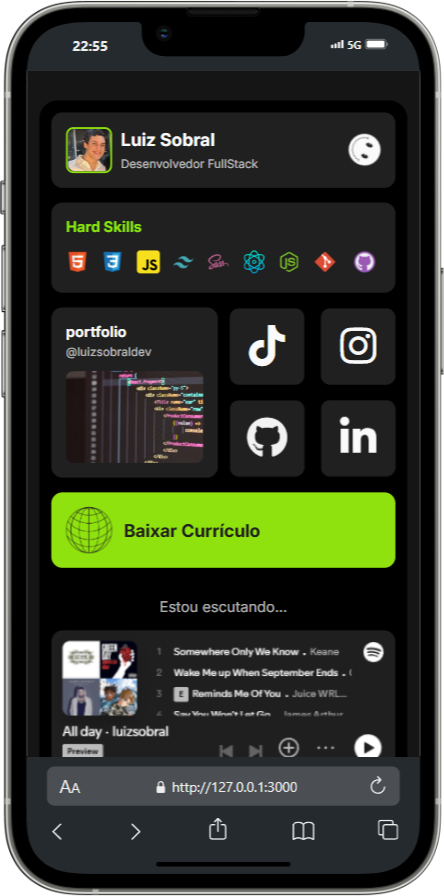

# Imagem do Projeto



## Características

- **Loading Screen Customizado:** Uma tela de carregamento animada que mostra o progresso em porcentagem até que o site esteja completamente carregado.
- **Perfil do Usuário:** Informações do desenvolvedor com foto, nome e título.
- **Habilidades Técnicas:** Ícones de tecnologias que destacam as hard skills do desenvolvedor.
- **Links para Redes Sociais:** Links diretos para TikTok, Instagram, GitHub e LinkedIn.
- **Widget para Portfólio:** Link para a o portfólio pessoal.
- **Link do Currículo** Links para o baixar o currículo pessoal.

## Tecnologias Utilizadas

- HTML5
- CSS3
- JavaScript
- FontAwesome e icon-icons para ícones
- Inter Font do Google Fonts

## Estrutura de Arquivos

```plaintext
/projeto
|-- index.html
|-- style.css
|-- animationLoading.js
|-- /img
    |-- foto-perfil.png
    |-- print-linkbio.png
    |-- smile-icon.png
    |-- web-black-icon.png
    |-- site.png
|-- /icons
    |-- css.png
    |-- git.png
    |-- github.png
    |-- html.png
    |-- js.png
    |-- node.png
    |-- react.png
    |-- sass.png
    |-- tailwind.png
|-- /docs
    |-- Curriculo-LuizSobral.pdf
```

## Como Usar

1. Clone o repositório em sua máquina local usando `git clone [URL do Repositório]`.
2. Abra o arquivo `index.html` em um navegador para visualizar o site.
3. Explore as diferentes seções clicando nos links e ícones disponíveis.

## Autor

**Luiz Sobral**
- [Perfil no GitHub](https://github.com/luizsobraldev)
- [LinkedIn](https://www.linkedin.com/in/luiz-sobral-dev/)
- [Instagram](https://www.instagram.com/luizsobraldev/)
